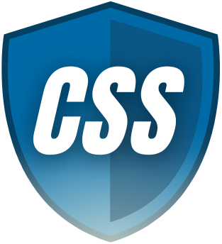
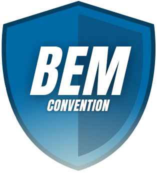

#  Sanah Poezje Website

 Made by Klaudia Kępka

##  Sanah Poezje Demo Website:
[Sanah Poezje Demo Website](https://kepkaklaudia.github.io/myFirstPage/)

##  Quick Preview

## Logo
You can find the centered artist logo at the top of the page.
The logo contains link which can bring you on the top of this page.

## Fixed Menu
Fixed Menu shows the content of the page.
You can use it if you want to skip part of the page and go to the song that interests you.

## Special button - background color changing
There is a special button below the fixed menu on the right side of the page. 
You can use it to change the background color. Color of the button and the text inside of it is changing as well. 

## Introductory section
You can find here some basic informations about the content of the page.

## Main content
It is the most important part of the page that contains all the content. Here you can find the titles and lyrics of 10 poetry-inspired songs with links to the Youtube page.

## Table
Tabular list of songs with names of poets and links to the Youtube page. 

## Footer
At the very bottom of the page there is a fixed footer with links to Youtube and social media such as Instagram, Facebook, Twitter.

## Responsive version
When you are in mobile/tablet mode (maximum width of screen: 908px) you can notice some changes. 

The navigation menu is not visible but you can open it by clicking "Utwory" button. Then it will be hidden after clicking on the name of the song or any other point of the page.

The change background button is slightly changed - it is placed in a blue box and does not change its background when clicked.

## Technologies used
     

This is my first website - thank you for your understanding!
The website was created for training purposes. Still learning!